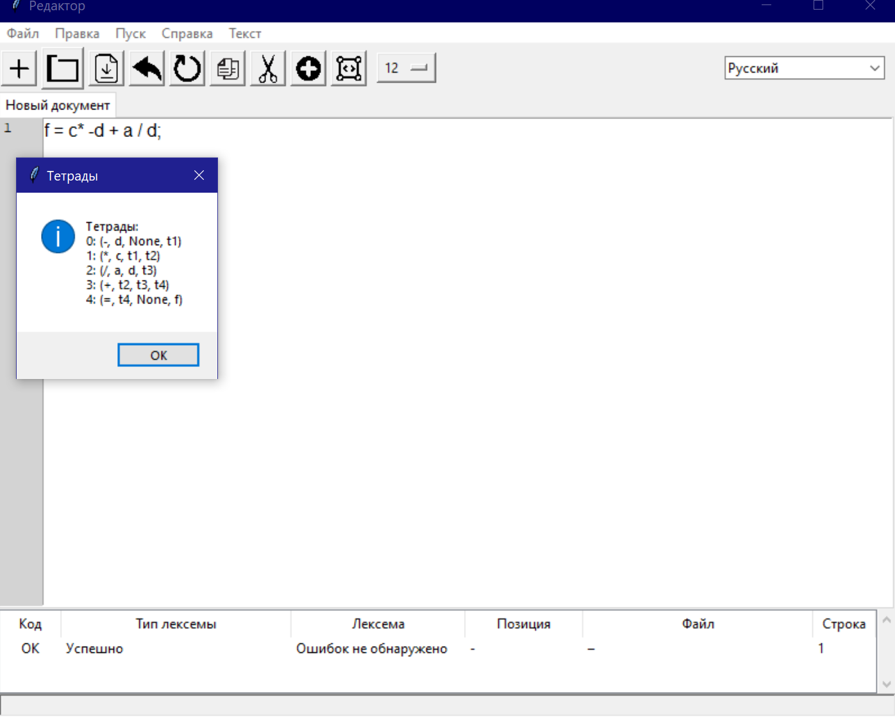
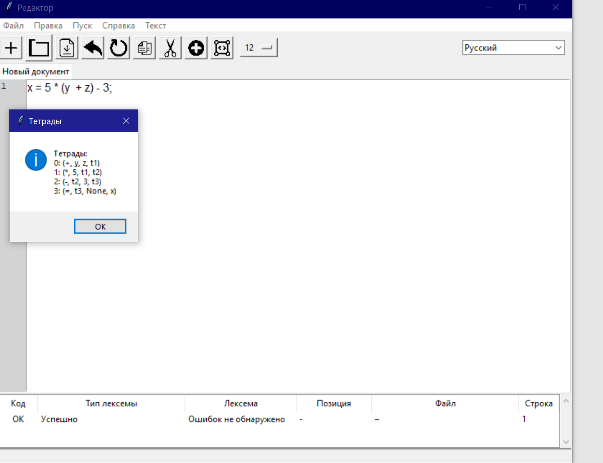

# 🧪 Лабораторная работа №5

## 🎯 Тема

**Включение семантики в анализатор. Создание внутренней формы представления программы.**

## 📌 Цель работы

Дополнить анализатор, разработанный в рамках предыдущих лабораторных работ, этапом **формирования внутренней формы представления программы**.

---

## 📝 Задание (Вариант 2)

В качестве внутренней формы представления программы выберем **тетрады**.
Тетрада состоит из четырёх полей: `op`, `arg1`, `arg2`, `result`.

---

### 📐 Этап 1 — Расширение парсера

Дополнить парсер грамматикой **G\[<АВ>]** и реализовать её методом **рекурсивного спуска**:

```
E → T A  
A → ε | + T A | - T A  
T → O B  
B → ε | * O B | / O B  
O → id | ( E )
```

---

### 🧮 Этап 2 — Формирование тетрад

Реализовать алгоритм **записи выражений в форме тетрад**.

#### ✅ Примеры корректных выражений:

* `f = c * -d + a / d;`
* `x = 5 * (y + z) - 3;`
* `t = (p + q) * r - s / u;`

---

## 🧪 Тестовые примеры

### ▶️ Пример 1



### ▶️ Пример 2



### ▶️ Пример 3


